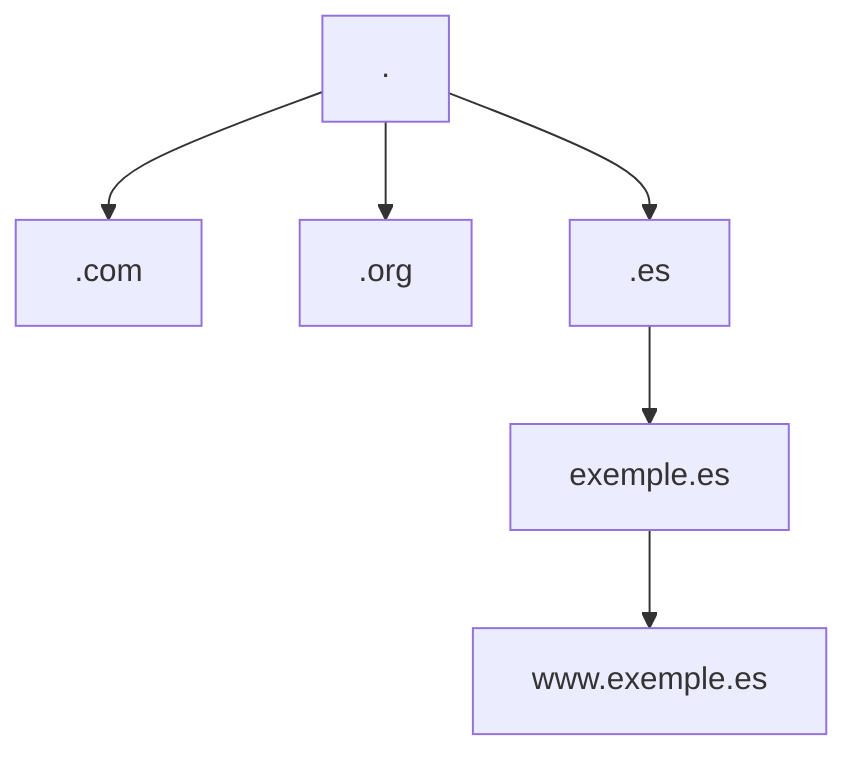
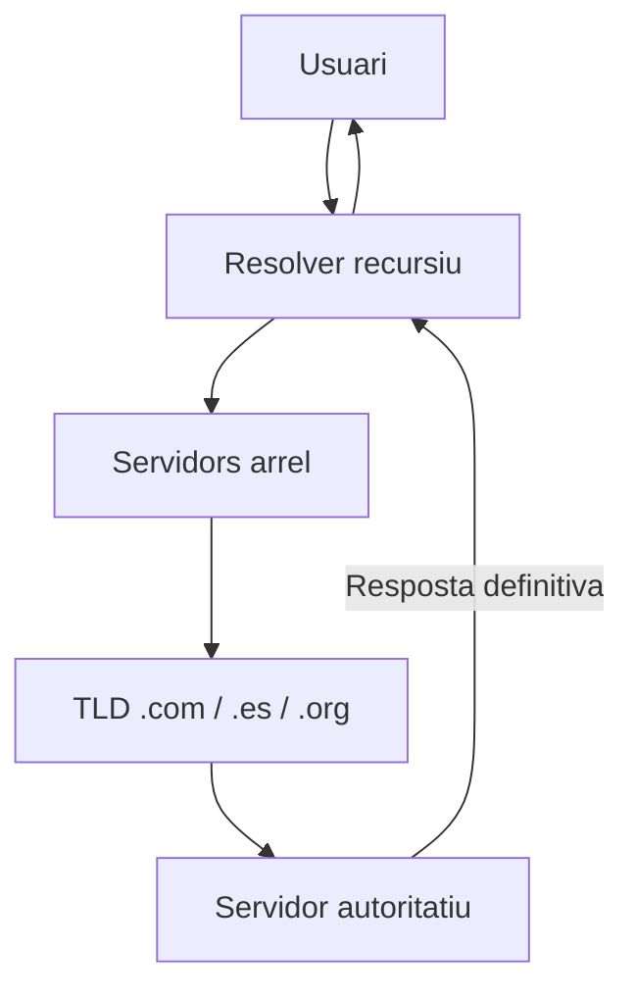

# DNS - Sistema de Noms de Domini
---

## Introducció al DNS

### Què és el DNS?

El Domain Name System (DNS) és un servei fonamental d'Internet que actua com el "llistat telefònic d'Internet", traduint noms de domini llegibles pels humans (com ara google.com) en adreces IP numèriques (com ara 142.250.185.78) que les màquines poden entendre i utilitzar per comunicar-se entre elles.

Sense DNS, hauríem de recordar les adreces IP numèriques de cada lloc web que volguéssim visitar, quelcom pràcticament impossible en l'Internet actual amb milions de llocs web disponibles. Aquest sistema distribuït i jeràrquic permet que Internet funcioni de manera eficient i escalable.

### Per què és important el DNS?

La importància del DNS radica en diversos factors crítics per al funcionament d'Internet i les xarxes corporatives. En primer lloc, proporciona una capa d'abstracció entre els usuaris i la infraestructura tècnica subjacent, permetent que els usuaris utilitzin noms memorables en lloc de números complexos.

A més, el DNS és essencial per a la redundància i l'equilibri de càrrega. Un mateix nom de domini pot resoldre's a múltiples adreces IP, permetent distribuir el trànsit entre diversos servidors i proporcionar alta disponibilitat. També facilita la mobilitat dels serveis, ja que podem canviar l'adreça IP d'un servidor sense que els usuaris hagin de modificar res.

---

## Història i Evolució del DNS

### Els Orígens: ARPANET i el fitxer HOSTS

Abans del DNS, a principis dels anys 70, ARPANET (el precursor d'Internet) utilitzava un sistema molt simple per a la resolució de noms. Cada ordinador mantenia un fitxer local anomenat HOSTS.TXT que contenia una llista de tots els ordinadors de la xarxa amb les seves adreces IP corresponents.

Aquest fitxer es mantenia centralment al Stanford Research Institute (SRI) i els administradors de sistemes havien de descarregar-lo regularment via FTP per mantenir les seves còpies actualitzades. A mesura que ARPANET creixia, aquest sistema es va tornar insostenible per diversos motius: el fitxer creixia exponencialment, la càrrega al servidor central era enorme, i mantenir la consistència entre totes les còpies era pràcticament impossible.

### El naixement del DNS (1983-1987)

[Paul Mockapetris](https://ca.wikipedia.org/wiki/Paul_Mockapetris) va desenvolupar el DNS el 1983 a la University of Southern California com a solució als problemes del sistema HOSTS.TXT. Les especificacions originals es van publicar als RFC 882 i 883 el novembre de 1983, posteriorment substituïts pels RFC 1034 i 1035 el 1987, que encara són la base del DNS actual.

El nou sistema introduïa conceptes revolucionaris com la jerarquia de dominis, la delegació d'autoritat, i la resolució distribuïda. Això permetia que cada organització gestionés el seu propi espai de noms sense dependre d'una autoritat central per a cada canvi.

### BIND: La implementació de referència

BIND (Berkeley Internet Name Domain) és la implementació més antiga i utilitzada del protocol DNS, desenvolupada originalment a la University of California Berkeley. La primera versió de BIND es va llançar el 1984 com a part del sistema operatiu BSD 4.3.

BIND 9, llançat el 2000, va ser una reescriptura completa del programari per millorar la seguretat, l'escalabilitat i afegir suport per a IPv6 i DNSSEC. Actualment, BIND continua sent el servidor DNS més desplegat a Internet, utilitzat tant per servidors arrel com per grans proveïdors de serveis.

### El naixement d'ICANN (1998)

Durant els anys 80 i 90, la gestió dels noms de domini i adreces IP estava força centralitzada. L’IANA (Internet Assigned Numbers Authority), dirigida per Jon Postel a la Universitat del Sud de Califòrnia (USC/ISI), era qui coordinava manualment moltes d’aquestes tasques. Però amb l’explosió d’Internet als 90, aquest model ja no era sostenible:

* Cada vegada hi havia més dominis i més usuaris.
* Empreses privades (com Network Solutions) havien obtingut contractes per gestionar registres de dominis, i això generava tensions sobre competència i preus.
* El govern dels Estats Units, a través del Departament de Comerç, encara tenia un paper molt fort en la governança d’Internet, cosa que altres països i actors volien internacionalitzar.

Per això, el 1998 es va crear l’[ICANN](https://www.icann.org/es) (Internet Corporation for Assigned Names and Numbers), una entitat sense ànim de lucre establerta a Califòrnia, amb la missió de gestionar aquestes funcions de manera més oberta, transparent i global.

#### Funcions principals d’ICANN

ICANN no controla Internet, però sí que administra les peces bàsiques que la fan funcionar de manera única i coherent:

* Gestió del sistema de noms de domini (DNS)
  * Coordina els TLD (Top-Level Domains) com .com, .org, .net, i també els de codi de país (.es, .cat, .fr…).
  * Acredita i regula els registradors de dominis (empreses com GoDaddy, Namecheap, etc.).
* Assignació d’adreces IP i recursos d’Internet
  * Supervisa la distribució global dels blocs d’adreces IPv4 i IPv6.Ho fa a través dels RIRs (Regional Internet Registries) com RIPE NCC (Europa), ARIN (Amèrica del Nord), APNIC (Àsia-Pacífic), etc.
* Gestió del sistema de servidors arrel del DNS
  * Coordina els 13 servidors arrel lògics (A–M).
  * S’assegura que hi hagi coherència i seguretat en la jerarquia global de noms.
* Polítiques de governança d’Internet
  * Facilita processos oberts i participatius on comunitats tècniques, empreses, governs i usuaris debaten i defineixen regles sobre dominis, noves extensions (.app, .shop, etc.), seguretat, i privacitat.
* Seguretat i estabilitat
  * Promou protocols com DNSSEC per protegir la integritat de les respostes DNS.
  * Vetlla perquè Internet continuï sent estable i interoperable arreu del món.

---

## Arquitectura i Funcionament del DNS

### Estructura Jeràrquica

El DNS s'organitza en una estructura d'arbre invertit amb diversos nivells. Al cim de la jerarquia trobem el domini arrel (root), representat per un punt (.). Sota l'arrel hi ha els dominis de primer nivell (TLD - Top Level Domains) com .com, .org, .es, .cat, etc.

<center>


</center>

Cada nivell de la jerarquia delega l'autoritat sobre els seus subdominis al nivell inferior. Per exemple, el TLD .es delega l'autoritat sobre exemple.es a l'organització que ha registrat aquest domini. Aquesta delegació permet una gestió distribuïda i escalable del sistema global de noms.

### Components del Sistema DNS

El sistema DNS consta de diversos components clau que treballen conjuntament:

**Servidors DNS Recursius (Resolvers):** Aquests servidors reben consultes dels clients i s'encarreguen de trobar la resposta navegant per la jerarquia DNS. Mantenen una memòria cau (cache) de les respostes per millorar el rendiment i reduir la càrrega a la xarxa. Son els servidors que utilitzen els usuaris finals (normalment els del teu ISP o serveis com Google DNS 8.8.8.8 o Cloudflare 1.1.1.1)

**Servidors DNS Autoritatius:** Contenen la informació autoritativa sobre una zona DNS específica. Quan un servidor és autoritatiu per a una zona, les seves respostes es consideren definitives per a aquell domini.

- ✅ **Respostes autoritàries** → provenen directament d’un servidor que gestiona la zona.
- ⚠️ **Respostes no autoritàries** → provenen de la cache d’un servidor recursiu.

**Servidors Arrel (Root Servers):** Són els servidors al cim de la jerarquia DNS. Actualment hi ha 13 adreces IP de servidors arrel (anomenades A-M), encara que físicament són centenars de servidors distribuïts globalment utilitzant anycast.

**Servidors de domini de primer nivell (TLD servers)**: Contenen la informació dels dominis d’un TLD concret (per exemple, .com, .org, .es, .cat). Quan un recursiu pregunta per www.exemple.cat, el servidor .cat li diu quins són els autoritatius per exemple.cat.

**Zona i registres DNS (namespace)**: Una zona DNS és la part de l’espai de noms que un servidor autoritatiu administra. 

**Caches DNS**:Tant els resolvers com els sistemes operatius i navegadors mantenen una cache local.Eviten repetir consultes i milloren el rendiment.Cada registre té un TTL (Time To Live) que marca quant de temps pot romandre en cache.

---

### Procés de Resolució DNS

Quan un usuari introdueix una URL al navegador, s'inicia un procés complex de resolució que segueix aquests passos:

<center>


</center>

1. **Consulta al resolver local:** El sistema operatiu primer consulta la seva cache local i el fitxer hosts. Si no troba la resposta, envia la consulta al servidor DNS configurat (normalment el del proveïdor d'Internet).

2. **Resolució recursiva:** Si el resolver no té la resposta a la seva cache, inicia una resolució recursiva començant pels servidors arrel, després els TLD, i finalment els servidors autoritatius del domini.

3. **Emmagatzematge en cache:** Cada resposta s'emmagatzema temporalment segons el seu TTL (Time To Live) per accelerar futures consultes.

4. **Retorn de la resposta:** Finalment, l'adreça IP es retorna a l'aplicació que la va sol·licitar.

---

## Tipus de Registres DNS

### Registres Bàsics

**Registre A (Address):** Mapeja un nom de domini a una adreça IPv4. És el tipus de registre més comú i fonamental. Per exemple: `www.exemple.cat IN A 192.0.2.1`

**Registre AAAA:** Similar al registre A però per a adreces IPv6. Exemple: `www.exemple.cat IN AAAA 2001:db8::1`

**Registre CNAME (Canonical Name):** Crea un àlies d'un nom a un altre. Útil per apuntar múltiples noms al mateix servidor. Exemple: `ftp.exemple.cat IN CNAME www.exemple.cat`

**Registre MX (Mail Exchange):** Especifica els servidors de correu per al domini, incloent una prioritat. Exemple: `exemple.cat IN MX 10 mail.exemple.cat`

### Registres Avançats

**Registre NS (Name Server):** Indica quins servidors DNS són autoritatius per a una zona. Fonamental per a la delegació de subdominis.

**Registre PTR (Pointer):** Utilitzat per a la resolució inversa (d'IP a nom). Essencial per a la verificació de servidors de correu.

**Registre SOA (Start of Authority):** Conté informació administrativa sobre la zona, incloent el servidor primari, el correu de l'administrador, i diversos temporitzadors per a la sincronització.

**Registre TXT:** Permet emmagatzemar text arbitrari. Utilitzat per SPF, DKIM, verificació de domini, i altres propòsits.

**Registre SRV (Service):** Especifica la ubicació de serveis específics, incloent port i prioritat. Utilitzat per protocols com SIP, XMPP, i Active Directory.

**Registre CAA (Certification Authority Authorization):** Especifica quines autoritats de certificació poden emetre certificats SSL per al domini.

---

## Configuració de DNS en Linux amb BIND9

### Instal·lació de BIND9

En sistemes basats en Debian/Ubuntu, la instal·lació és senzilla:

```bash
# Actualització del sistema
sudo apt update && sudo apt upgrade -y

# Instal·lació de BIND9 i eines relacionades
sudo apt install -y bind9 bind9utils bind9-doc dnsutils

# Verificació del servei
sudo systemctl status bind9
```

Per a sistemes basats en Red Hat/CentOS:

```bash
# Instal·lació en RHEL/CentOS
sudo dnf install -y bind bind-utils

# Iniciar i habilitar el servei
sudo systemctl enable named
sudo systemctl start named
```

### Estructura de Fitxers de Configuració

Els fitxers de configuració de BIND es troben a `/etc/bind/` en sistemes Debian/Ubuntu. L'estructura típica inclou:

- **named.conf:** Fitxer principal de configuració
- **named.conf.options:** Opcions globals del servidor
- **named.conf.local:** Definició de zones locals
- **named.conf.default-zones:** Zones per defecte (localhost, broadcast, etc.)

### Configuració Bàsica del Servidor

Configuració del fitxer `/etc/bind/named.conf.options`:

```bash
# Definició de la xarxa interna
acl "xarxa-interna" {
    192.168.1.0/24;
    10.0.0.0/8;
    localhost;
};

options {
    directory "/var/cache/bind";
    
    # Configuració de seguretat
    recursion yes;
    allow-recursion { xarxa-interna; };
    allow-query { xarxa-interna; };
    allow-transfer { none; };
    
    # Forwarders (DNS externs)
    forwarders {
        8.8.8.8;        # Google DNS
        1.1.1.1;        # Cloudflare DNS
    };
    forward only;
    
    # Configuració DNSSEC
    dnssec-validation auto;
    
    # IPv6
    listen-on-v6 { any; };
    
    # Amagar versió de BIND
    version "DNS Server";
};
```

### Creació de Zones

Definició de zones al fitxer `/etc/bind/named.conf.local`:

```bash
# Zona directa
zone "empresa.local" IN {
    type master;
    file "/etc/bind/zones/db.empresa.local";
    allow-update { none; };
};

# Zona inversa
zone "1.168.192.in-addr.arpa" IN {
    type master;
    file "/etc/bind/zones/db.192.168.1";
    allow-update { none; };
};
```

Exemple de fitxer de zona directa (`/etc/bind/zones/db.empresa.local`):

```bash
$TTL 86400
@       IN      SOA     ns1.empresa.local. admin.empresa.local. (
                        2024010101      ; Serial
                        3600            ; Refresh (1 hora)
                        1800            ; Retry (30 minuts)
                        604800          ; Expire (1 setmana)
                        86400 )         ; Minimum TTL (1 dia)

; Servidors de noms
        IN      NS      ns1.empresa.local.
        IN      NS      ns2.empresa.local.

; Registres A
ns1     IN      A       192.168.1.10
ns2     IN      A       192.168.1.11
www     IN      A       192.168.1.20
mail    IN      A       192.168.1.25
ftp     IN      A       192.168.1.30

; Registres CNAME
webmail IN      CNAME   mail
portal  IN      CNAME   www

; Registre MX
@       IN      MX      10      mail.empresa.local.

; Registres TXT
@       IN      TXT     "v=spf1 mx -all"
```

---

## Configuració de DNS en Windows Server

### Instal·lació del Rol DNS

En Windows Server 2022, la instal·lació del rol DNS es pot fer mitjançant Server Manager o PowerShell.

Mitjançant PowerShell:

```powershell
# Instal·lació del rol DNS
Install-WindowsFeature -Name DNS -IncludeManagementTools

# Verificació de la instal·lació
Get-WindowsFeature -Name DNS

# Reiniciar el servei DNS
Restart-Service DNS
```

Mitjançant Server Manager:

1. Obrir Server Manager
2. Seleccionar "Add Roles and Features"
3. Seleccionar "Role-based or feature-based installation"
4. Triar el servidor local
5. Marcar "DNS Server"
6. Completar l'assistent d'instal·lació

### Configuració de Zones

La configuració es pot fer des de la consola DNS (dnsmgmt.msc) o PowerShell.

Creació de zona directa amb PowerShell:

```powershell
# Crear zona primària
Add-DnsServerPrimaryZone -Name "empresa.local" `
    -ReplicationScope "Domain" `
    -DynamicUpdate "Secure"

# Afegir registres A
Add-DnsServerResourceRecordA -Name "www" `
    -ZoneName "empresa.local" `
    -IPv4Address "192.168.1.20" `
    -TimeToLive 01:00:00

# Afegir registre MX
Add-DnsServerResourceRecordMX -Name "." `
    -ZoneName "empresa.local" `
    -MailExchange "mail.empresa.local" `
    -Preference 10
```

### Configuració de Forwarders

```powershell
# Configurar DNS forwarders
Add-DnsServerForwarder -IPAddress 8.8.8.8
Add-DnsServerForwarder -IPAddress 1.1.1.1

# Verificar forwarders
Get-DnsServerForwarder
```

### Configuració de DNS Segur

Windows Server 2022 suporta DNS over HTTPS (DoH) per al client DNS:

```powershell
# Afegir servidor DoH conegut
Add-DnsClientDohServerAddress `
    -ServerAddress "1.1.1.1" `
    -DohTemplate "https://cloudflare-dns.com/dns-query" `
    -AllowFallbackToUdp $False `
    -AutoUpgrade $True

# Verificar configuració DoH
Get-DnsClientDohServerAddress
```

---

## DNS Secundari i Replicació

### Concepte de DNS Secundari

Un servidor DNS secundari manté una còpia de només lectura de les zones d'un servidor primari. Això proporciona redundància i millora el rendiment distribuint la càrrega de consultes.

El servidor secundari sincronitza periòdicament les seves dades amb el primari mitjançant transferències de zona.

### Configuració en Linux

Al servidor primari, modificar la zona per permetre transferències:

```bash
zone "empresa.local" {
    type master;
    file "/etc/bind/zones/db.empresa.local";
    allow-transfer { 192.168.1.11; };  # IP del secundari
    also-notify { 192.168.1.11; };
};
```

Al servidor secundari:

```bash
zone "empresa.local" {
    type slave;
    file "/var/cache/bind/db.empresa.local";
    masters { 192.168.1.10; };  # IP del primari
};
```

### Configuració en Windows

```powershell
# Al servidor primari - permetre transferències
Set-DnsServerPrimaryZone -Name "empresa.local" `
    -SecondaryServers "192.168.1.11" `
    -SecureSecondaries TransferToSecureServers

# Al servidor secundari - crear zona secundària
Add-DnsServerSecondaryZone -Name "empresa.local" `
    -ZoneFile "empresa.local.dns" `
    -MasterServers "192.168.1.10"
```

---

## Resolució de Problemes i Eines de Diagnòstic

### Eines Bàsiques

**nslookup:** Eina multiplataforma per a consultes DNS bàsiques:

```bash
# Consulta simple
nslookup www.google.com

# Consulta a servidor específic
nslookup www.google.com 8.8.8.8

# Consulta de registre MX
nslookup -type=mx gmail.com
```

**dig (Domain Information Groper):** Eina més potent i flexible:

```bash
# Consulta detallada
dig www.exemple.cat

# Consulta específica de tipus
dig MX exemple.cat

# Traçar el camí de resolució
dig +trace www.exemple.cat

# Consulta inversa
dig -x 192.0.2.1
```

**host:** Eina simple per a consultes ràpides:

```bash
# Consulta bàsica
host www.exemple.cat

# Tots els registres
host -a exemple.cat
```

### Diagnòstic Avançat

**Verificació de configuració BIND:**

```bash
# Verificar sintaxi de named.conf
sudo named-checkconf

# Verificar fitxer de zona
sudo named-checkzone empresa.local /etc/bind/zones/db.empresa.local

# Veure el log del servei
sudo journalctl -u bind9 -f
```

**Anàlisi de cache:**

```bash
# Veure estadístiques del servidor
sudo rndc stats

# Buidar la cache
sudo rndc flush

# Veure la cache actual
sudo rndc dumpdb -cache
```

### Problemes Comuns i Solucions

**Problema: El servidor no respon a consultes externes**

Solució: Verificar la configuració d'`allow-query` i les regles del firewall:

```bash
# Verificar configuració
grep -i "allow-query" /etc/bind/named.conf.options

# Obrir ports al firewall (Ubuntu/UFW)
sudo ufw allow 53/tcp
sudo ufw allow 53/udp
```

**Problema: La zona no es transfereix al servidor secundari**

Solució: Verificar `allow-transfer` i incrementar el número de sèrie:

```bash
# Al primari - verificar permisos de transferència
grep -i "allow-transfer" /etc/bind/named.conf.local

# Incrementar serial i recarregar
sudo nano /etc/bind/zones/db.empresa.local  # Incrementar serial
sudo rndc reload empresa.local
```

---

## Seguretat DNS

### Principals Amenaces

Segons una enquesta d'IDC de 2021, el 87% de les organitzacions han patit atacs DNS, amb un cost mitjà d'aproximadament 950.000 dòlars per atac.

**DNS Cache Poisoning (Enverinament de Cache):**

Aquest atac intenta corrompre la cache DNS per redirigir els usuaris a llocs maliciosos. L'atacant injecta respostes DNS falses abans que arribi la resposta legítima.

**DNS Amplification/DDoS:**

L'atacant envia peticions DNS amb l'adreça IP de la víctima falsificada com a origen, causant que les respostes (molt més grans) es dirigeixin a la víctima.

**DNS Tunneling:**

Tècnica que codifica dades en consultes i respostes DNS per exfiltrar informació o establir canals de comandament i control evitant els firewalls.

**DNS Hijacking:**

L'atacant modifica els servidors DNS o el registrador de domini per desviar el trànsit.

### DNSSEC (DNS Security Extensions)

DNSSEC afegeix signatures digitals als registres DNS per garantir-ne l'autenticitat i integritat.

Configuració de DNSSEC en BIND9:

```bash
# Generar claus per a la zona
cd /etc/bind/keys/
dnssec-keygen -a RSASHA256 -b 2048 -n ZONE empresa.local
dnssec-keygen -a RSASHA256 -b 4096 -n ZONE -f KSK empresa.local

# Signar la zona
dnssec-signzone -A -3 $(head -c 1000 /dev/random | sha1sum | cut -b 1-16) \
    -N INCREMENT -o empresa.local -t \
    /etc/bind/zones/db.empresa.local

# Configurar BIND per usar la zona signada
zone "empresa.local" {
    type master;
    file "/etc/bind/zones/db.empresa.local.signed";
    # ... resta de configuració
};
```

### Millors Pràctiques de Seguretat

Les millors pràctiques inclouen implementar limitació de taxa (rate limiting) per controlar el volum de trànsit DNS.

**1. Restringir Consultes Recursives:**

```bash
# Només permetre recursió des de xarxes de confiança
options {
    recursion yes;
    allow-recursion { xarxa-interna; };
};
```

**2. Implementar Rate Limiting:**

```bash
# Limitar consultes per client
rate-limit {
    responses-per-second 10;
    window 5;
};
```

**3. Amagar Versió de BIND:**

```bash
options {
    version "DNS Server";
    hostname "NS";
    server-id none;
};
```

**4. Desactivar Transferències de Zona No Autoritzades:**

```bash
options {
    allow-transfer { none; };
};

# O només a servidors específics
zone "empresa.local" {
    allow-transfer { 192.168.1.11; key transfer-key; };
};
```

**5. Utilitzar TSIG per a Transferències Segures:**

```bash
# Generar clau TSIG
dnssec-keygen -a HMAC-SHA256 -b 256 -n HOST transfer-key

# Configurar la clau
key "transfer-key" {
    algorithm hmac-sha256;
    secret "base64-encoded-secret-key";
};

# Usar la clau per a transferències
server 192.168.1.11 {
    keys { transfer-key; };
};
```

### Monitorització i Detecció d'Amenaces

És essencial registrar i monitoritzar les consultes DNS per detectar anomalies.

Configuració de logging detallat:

```bash
logging {
    channel security_log {
        file "/var/log/bind/security.log" versions 3 size 10m;
        severity info;
        print-time yes;
        print-severity yes;
        print-category yes;
    };
    
    channel query_log {
        file "/var/log/bind/query.log" versions 3 size 50m;
        severity info;
        print-time yes;
    };
    
    category security { security_log; };
    category queries { query_log; };
    category query-errors { query_log; };
};
```

Eines per analitzar logs:

```bash
# Veure les consultes més freqüents
cat /var/log/bind/query.log | grep "query:" | \
    awk '{print $8}' | sort | uniq -c | sort -rn | head -20

# Detectar possibles atacs DDoS
tail -f /var/log/bind/query.log | \
    grep -E "denied|REFUSED|SERVFAIL"

# Analitzar patrons sospitosos
grep -E "ANY|AXFR" /var/log/bind/query.log
```

---

## DNS en Entorns Cloud i Contenidors

### DNS en Kubernetes

Kubernetes utilitza CoreDNS com a servidor DNS per defecte, proporcionant resolució de noms per a serveis i pods.

Exemple de configuració de CoreDNS:

```yaml
apiVersion: v1
kind: ConfigMap
metadata:
  name: coredns
  namespace: kube-system
data:
  Corefile: |
    .:53 {
        errors
        health {
           lameduck 5s
        }
        ready
        kubernetes cluster.local in-addr.arpa ip6.arpa {
           pods insecure
           fallthrough in-addr.arpa ip6.arpa
           ttl 30
        }
        prometheus :9153
        forward . /etc/resolv.conf {
           max_concurrent 1000
        }
        cache 30
        loop
        reload
        loadbalance
    }
```

### DNS en Docker

Docker utilitza un servidor DNS embedded per a la resolució de noms entre contenidors:

```bash
# Crear xarxa personalitzada amb DNS
docker network create --driver bridge \
    --subnet=172.20.0.0/16 \
    --opt "com.docker.network.bridge.name"="docker-dns" \
    mynetwork

# Executar contenidor amb DNS personalitzat
docker run -d \
    --name myapp \
    --network mynetwork \
    --dns 8.8.8.8 \
    --dns-search exemple.local \
    nginx
```

### 1DNS com a Servei (DNS-as-a-Service)

Molts proveïdors cloud ofereixen serveis DNS gestionats:

- **AWS Route 53:** Servei DNS altament disponible i escalable
- **Azure DNS:** Integrat amb els serveis de Microsoft Azure
- **Google Cloud DNS:** DNS global amb baixa latència
- **Cloudflare DNS:** Conegut per la seva velocitat i seguretat

---

## Optimització del Rendiment

### Configuració de Cache

Optimitzar la cache pot millorar significativament el rendiment:

```bash
options {
    # Cache per a respostes positives
    max-cache-size 256m;
    max-cache-ttl 86400;
    
    # Cache per a respostes negatives
    max-ncache-ttl 3600;
    
    # Prefetch de registres abans que expirin
    prefetch 2 9;
};
```

### Configuració de Views (Split-horizon DNS)

Permet servir diferents respostes segons l'origen de la consulta:

```bash
# Definir ACLs
acl "interna" { 192.168.0.0/16; 10.0.0.0/8; };
acl "externa" { any; };

# Vista interna
view "interna" {
    match-clients { interna; };
    
    zone "empresa.local" {
        type master;
        file "/etc/bind/zones/interna/db.empresa.local";
    };
};

# Vista externa
view "externa" {
    match-clients { externa; };
    
    zone "empresa.local" {
        type master;
        file "/etc/bind/zones/externa/db.empresa.local";
    };
};
```

### Anycast DNS

Utilitzar anycast permet dirigir les consultes al servidor més proper geogràficament:

```bash
# Configuració BGP per anycast (exemple amb BIRD)
protocol bgp {
    local as 65001;
    neighbor 192.0.2.1 as 65000;
    
    export filter {
        if net = 203.0.113.53/32 then accept;
        reject;
    };
}
```

---

## Compliment Normatiu i Estàndards

### 12.1 RFCs Principals

Els Request for Comments (RFCs) són els documents que defineixen els estàndards d'Internet. Els més importants per a DNS són:

- **RFC [1034](https://www.rfc-editor.org/rfc/rfc1034) i [1035](https://www.rfc-editor.org/rfc/rfc1035) (1987):** Definicions bàsiques del DNS
- **RFC [2181](https://www.rfc-editor.org/rfc/rfc2181) (1997):** Clarificacions sobre l'especificació DNS
- **RFC [2308](https://www.rfc-editor.org/rfc/rfc2308) (1998):** Negative caching
- **RFC [4033-4035](https://www.rfc-editor.org/rfc/rfc4033) (2005):** DNSSEC
- **RFC [6891](https://www.rfc-editor.org/rfc/rfc6891) (2013):** Extension Mechanisms for DNS (EDNS)
- **RFC [7858](https://www.rfc-editor.org/rfc/rfc7858) (2016):** DNS over TLS (DoT)
- **RFC [8484](https://www.rfc-editor.org/rfc/rfc8484) (2018):** DNS over HTTPS (DoH)
- **RFC [9250](https://www.rfc-editor.org/rfc/rfc9250) (2022):** DNS over QUIC (DoQ)

### Compliment GDPR

Sota el GDPR, les consultes DNS poden contenir dades personals. Recomanacions:

- Minimitzar el logging de consultes DNS
- Anonimitzar adreces IP als logs
- Establir períodes de retenció curts
- Xifrar les comunicacions DNS (DoH/DoT)

!!! note annotate "La traçabilitat de la navegació"


---

## Casos d'Ús i Escenaris Pràctics

### DNS per a Active Directory

Active Directory depèn completament del DNS per al seu funcionament:

```bash
# Zones necessàries per AD
_msdcs.domini.local
_sites.domini.local
_tcp.domini.local
_udp.domini.local
```

### DNS per a Serveis de Correu

Configuració completa per a un servidor de correu:

```bash
# Registres necessaris
@           IN  MX  10  mail.exemple.cat.
mail        IN  A       203.0.113.10
@           IN  TXT     "v=spf1 mx -all"
_dmarc      IN  TXT     "v=DMARC1; p=quarantine; rua=mailto:dmarc@exemple.cat"
default._domainkey IN TXT "v=DKIM1; k=rsa; p=MIGfMA0GCS..."
```

### DNS per a Balanceig de Càrrega

Utilitzar múltiples registres A per distribuir trànsit:

```bash
www         IN  A   203.0.113.10
www         IN  A   203.0.113.11
www         IN  A   203.0.113.12
```

---

## 14. Tendències Futures

### 14.1 DNS over HTTPS (DoH) i DNS over TLS (DoT)

Aquests protocols xifren les consultes DNS per millorar la privadesa. Configuració de DoT en BIND 9.18+:

```bash
tls local-tls {
    cert-file "/etc/bind/certs/cert.pem";
    key-file "/etc/bind/certs/key.pem";
};

options {
    listen-on port 853 tls local-tls { any; };
};
```

### 14.2 DNS sobre QUIC (DoQ)

Protocol emergent que combina els beneficis de DoH/DoT amb menor latència utilitzant QUIC.

### 14.3 Integració amb IA i Machine Learning

Detecció d'anomalies i predicció d'amenaces utilitzant IA, amb precisió del 96% en alguns sistemes comercials.

---

## Referències i Recursos

### Documentació Oficial

- [**ISC BIND 9 Documentation**](https://www.isc.org/bind/)
- [**Microsoft DNS Server**](https://docs.microsoft.com/windows-server/networking/dns/)
- [**RFC Editor**](https://www.rfc-editor.org/)

### Llibres Recomanats

- "DNS and BIND" de Cricket Liu i Paul Albitz (O'Reilly)
- "DNS for Rocket Scientists" de Ron Aitchison (disponible online a zytrax.com)
- "DNS Security: Defending the Domain Name System" de Allan Liska i Timothy Gallo

### Eines i Recursos Online

- [**DNSViz:**](https://dnsviz.net/) Eina de visualització DNSSEC 
- [**DNS Dumpster:**](https://dnsdumpster.com/) Eina de reconeixement DNS 
- [**MXToolbox:**](https://mxtoolbox.com/) Suite d'eines per a diagnòstic DNS 
- [**Zonemaster:**](https://zonemaster.net/) Eina de validació de zones DNS 

### Comunitats i Fòrums

- **DNS-OARC:** DNS Operations, Analysis, and Research Center
- **NANOG Mailing List:** North American Network Operators Group
- **r/sysadmin:** Comunitat de Reddit per a administradors de sistemes

---

## Glossari de Termes

* **Authoritative Server:** Servidor que conté la informació oficial d'una zona DNS
* **Cache:** Memòria temporal que emmagatzema respostes DNS recents
* **CNAME Chasing:** Procés de seguir cadenes de registres CNAME fins arribar a un registre A
* **FQDN (Fully Qualified Domain Name):** Nom de domini complet incloent tots els nivells
* **Glue Record:** Registre A necessari quan un servidor de noms està dins del seu propi domini
* **Iterative Query:** Consulta on el servidor DNS retorna la millor resposta que pot sense fer consultes addicionals
* **NXDOMAIN:** Resposta que indica que el domini consultat no existeix
* **Recursive Query:** Consulta on el servidor DNS fa totes les consultes necessàries per obtenir la resposta completa
* **Root Hints:** Llista d'adreces IP dels servidors arrel
* **Round-Robin DNS:** Tècnica de balanceig de càrrega rotant entre múltiples registres A
* **SOA (Start of Authority):** Registre que conté informació administrativa sobre la zona
* **Split-horizon DNS:** Servir diferents respostes DNS segons l'origen de la consulta
* **TTL (Time To Live):** Temps que una resposta DNS pot ser emmagatzemada en cache
* **Zone Transfer:** Procés de copiar tots els registres d'una zona d'un servidor a un altre
* **Zone Walking:** Tècnica per enumerar tots els registres d'una zona DNS

---

## Activitats

