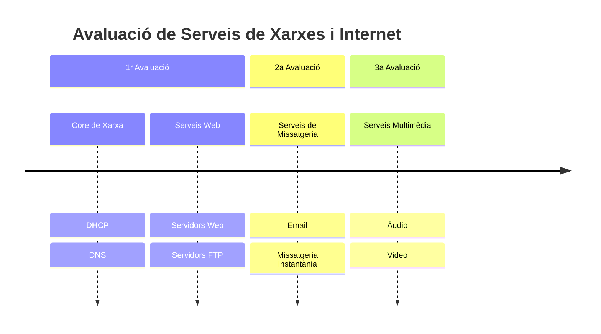

# Serveis de Xarxes i Internet

En aquest repositori agruparem els materials i activitats realitzades en el mòdul 0375 de Serveis de Xarxes i Internet del CFGS d'Administració de Sistemes i Xarxes (ASIX), el currículum del qual ve fixat pel [Reial Decret 405/2023](https://www.boe.es/boe/dias/2023/06/03/pdfs/BOE-A-2023-13221.pdf), impartit en l'[IES Sa Palomera](https://www.sapalomera.cat) de Blanes.

La competència que es treballa en aquest curs és:

* "Implantar i mantenir serveis de xarxa i internet, gestionant la seva configuració, seguretat i rendiment, per garantir la disponibilitat i l'optimització dels recursos en entorns professionals."

Aquesta competència implica capacitar l'alumnat per:

* Instal·lar i configurar serveis de xarxa com DNS, DHCP, FTP, HTTP(S), VPN, etc.
* Gestionar la seguretat dels serveis mitjançant tallafocs, autenticació i encriptació.
* Monitoritzar el rendiment dels serveis i aplicar mesures correctives quan sigui necessari.
* Garantir la disponibilitat i l'optimització dels recursos en entorns professionals.

## Resultats d'Aprenentatge

Els diferents resultats d'aprenentatge (RA) treballats juntament amb el seu pes aproximat, tal com s'indica en la programació didàctica, són:

| Codi | Descripció | Pes (%) |
|------|------------|---------|
| RA1 | Administra serveis de resolució de noms, analitzant-los i garantint la seguretat del servei. | 15 |
| RA2 | Administra serveis de configuració automàtica, identificant-los i verificant la correcta assignació dels paràmetres. | 15 |
| RA3 | Administra servidors web aplicant criteris de configuració i assegurant el funcionament del servei. | 15 |
| RA4 | Administra serveis de transferència fitxers assegurant i limitant l’accés a la informació. | 15 |
| RA5 |Administra servidors de correu electrònic, aplicant criteris de configuració i garantitzant la seguretat del servei | 10 |
| RA6 | Administra serveis de missatgeria instantània, notícies i llistes de distribució, verificant i assegurant l’accés dels usuaris. | 10 |
| RA7 | Administra serveis d’àudio identificant-ne les necessitats de distribució i adaptant els formats. | 10 |
| RA8 | Administra serveis de vídeo identificant-ne les necessitats de distribució i adaptant els formats. | 10 |
| **Total pesos**| | **100** |

## Nuclis Formatius

A partir dels RA, hem definit 4 nuclis formatius.

El mòdul de Serveis de Xarxa i Internet ve fixat amb una càrrega lectiva de 132h, de les quals 66h es fan en el centre i les altres 66 a l'empresa. Les classes estan repartides en 3 sessions setmanals, al llarg de 22 setmanes. Aquest curs s'ha planificat sobre un total de 22 setmanes, deixant les darreres setmanes per al desenvolupament, per part de l'alumnat, del programa formatiu dual en l'empresa o per l'execució del projecte. Aquestes 22 setmanes fan un total de 66h lectives.

A continuació, en la següent taula i a mode de mapa general, es mostren els diferents NF i els RA que cobreixen, indicant la càrrega horària emprada durant el present curs en cadascuna d'elles:

| Nuclis Formatius | RA1 | RA2 | RA3 | RA4 | RA5 | RA6 | RA7 | RA8 |
|--------------------|-----|-----|-----|-----|-----|-----|-----|-----|
| 1. Core de Xarxa | 10 | 10 |  |  |  |  |  |  |
| 2. Serveis web |  |  | 8 | 6 |  |  |  |  |
| 3. Missatgeria |  |  |  |  | 8 | 8 |    |
| 4. Serveis Multimedia |  |  |  |  |  |  | 8 | 8 
| **Total - 66h**     | 10 | 10 | 8 | 6 | 8 | 8 | 8 | 8 
| **Percentatge** | **15%** | **15%** | **12%** | **12%** | **10%** | **12%** | **12%** |**12%** |

Si ens centrem en la temporització, hem agrupat les unitats en diferents blocs repartits al llarg del curs del següent mode:

### Planificació temporal

## Avaluació

Per a l'avaluació del mòdul de Serveis de Xarxes i internet es ponderaran els resultats d'aprenentatge respecte als percentatges indicats en l'apartat anterior.

Per a l'avaluació de cada RA, utilitzarem diferents Instruments d'Avaluació (IA), com poden ser:

- **Activitats d'ensenyament/aprenentatge**(:simple-activitypub:), normalment realitzades a l'aula, acompanyades d'una rúbrica. Distingirem les activitats de classe (AC), les quals es qualificaran normalment sobre una escala de 3 punts, de les activitats de reforç (AR), també sobre 3 punts per consolidar un o diversos CA no aconseguits, així com activitats d'aprofundiment (AP) que aportaran punts extra al RA.

- **Pràctiques (PR) (:blue_book:) o treball de recerca (TR) (:material-file-question:)**, amb una càrrega temporal variable, entre una setmana o tota una unitat didàctica. Normalment qualificats sobre 10 punts.

- **Projectes (PY)**, bé de desenvolupament individual o en parelles, sobre un determinat RA. Normalment qualificats sobre 30 punts.

- **Proves objectives (PO)**. En alguns RA, i no de forma generalitzada, es realitzarà una prova objectiva (ja sigui escrita o en ordinador). Normalment qualificats sobre 30 punts.

Per calcular la qualificació de cada resultat d'aprenentatge, es realitzarà la mitjana ponderada simple dels diferents instruments d'avaluació emprats en dit RA. Per comprovar que s'han cobert tots els criteris d'avaluació, pots consultar la pàgina de validació.

Totes les qualificacions, tant dels instruments d'avaluació com dels propis RA, es podrà consultar en tot moment en la plataforma Aules del curs.

## Materials

Al llarg del curs, anirem treballant diferents materials disponibles en aquest espai web.

Cadascuna dels NF començarà amb un resum de la Proposta Didàctica que es planteja, els elements que cobrirà, tant el RA a treballar com els seus criteris d'avaluació (CA) associats, així com un qüestionari inicial per reflexionar el nostre coneixement previ.

En la part final de cada sessió, a més de diferents recursos de Referència per ampliar coneixements, es plantegen una sèrie d'Activitats que anirem treballant en la seva major mesura a l'aula. Cadascuna de les activitats indica el RA que cobreix, els CE que treballa així com la seva qualificació, la qual després es veurà reflectida en la rúbrica del lliurament de dita tasca a Aules. A més, les activitats estan codificades amb el prefix del tipus d'instrument d'avaluació, així com la unitat que cobreixen (per exemple, l'activitat AC207, serà la 7a activitat de classe del nucli formatiu 2).
